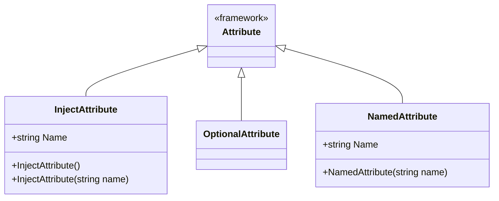
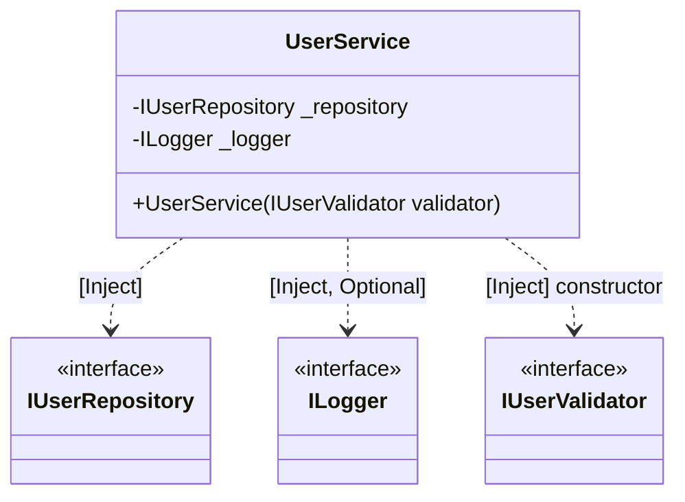
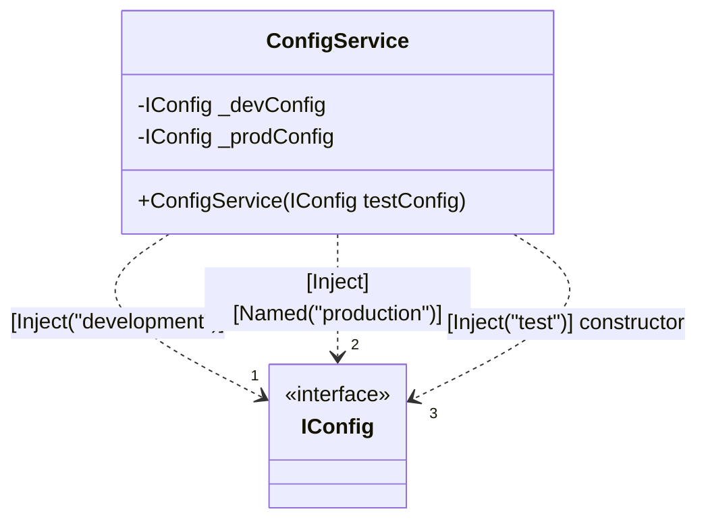
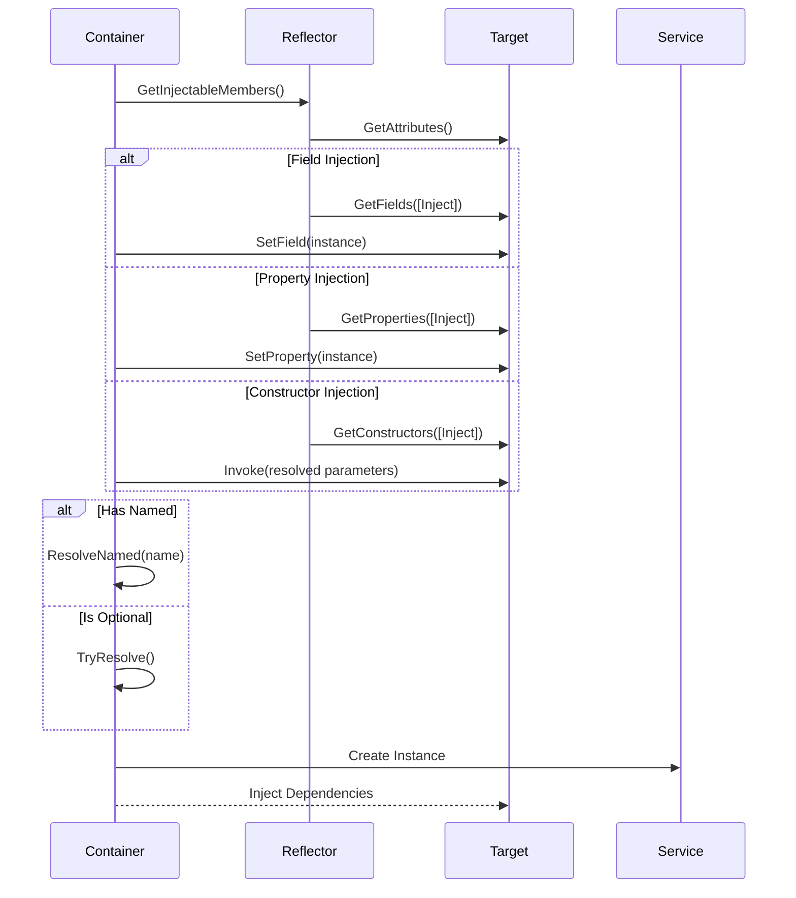

# 特性UML类图

## 特性类关系

```mermaid
classDiagram
    class Attribute {
        <<framework>>
    }
    
    class InjectAttribute {
        +string Name
        +InjectAttribute()
        +InjectAttribute(string name)
    }
    
    class OptionalAttribute {
    }
    
    class NamedAttribute {
        +string Name
        +NamedAttribute(string name)
    }
    
    Attribute <|-- InjectAttribute
    Attribute <|-- OptionalAttribute
    Attribute <|-- NamedAttribute
```

## 特性使用场景

```mermaid
classDiagram
    class UserService {
        -IUserRepository _repository
        -ILogger _logger
        +UserService(IUserValidator validator)
    }
    
    class IUserRepository {
        <<interface>>
    }
    
    class ILogger {
        <<interface>>
    }
    
    class IUserValidator {
        <<interface>>
    }
    
    UserService ..> IUserRepository : [Inject]
    UserService ..> ILogger : [Inject, Optional]
    UserService ..> IUserValidator : [Inject] constructor
```

## 特性组合使用

```mermaid
classDiagram
    class ConfigService {
        -IConfig _devConfig
        -IConfig _prodConfig
        +ConfigService(IConfig testConfig)
    }
    
    class IConfig {
        <<interface>>
    }
    
    ConfigService ..> "1" IConfig : [Inject("development")]
    ConfigService ..> "2" IConfig : [Inject][Named("production")]
    ConfigService ..> "3" IConfig : [Inject("test")] constructor
```

## 特性注入流程

```mermaid
sequenceDiagram
    participant Container
    participant Reflector
    participant Target
    participant Service
    
    Container->>Reflector: GetInjectableMembers()
    Reflector->>Target: GetAttributes()
    
    alt Field Injection
        Reflector->>Target: GetFields([Inject])
        Container->>Target: SetField(instance)
    else Property Injection
        Reflector->>Target: GetProperties([Inject])
        Container->>Target: SetProperty(instance)
    else Constructor Injection
        Reflector->>Target: GetConstructors([Inject])
        Container->>Target: Invoke(resolved parameters)
    end
    
    alt Has Named
        Container->>Container: ResolveNamed(name)
    else Is Optional
        Container->>Container: TryResolve()
    end
    
    Container->>Service: Create Instance
    Container-->>Target: Inject Dependencies
``` 