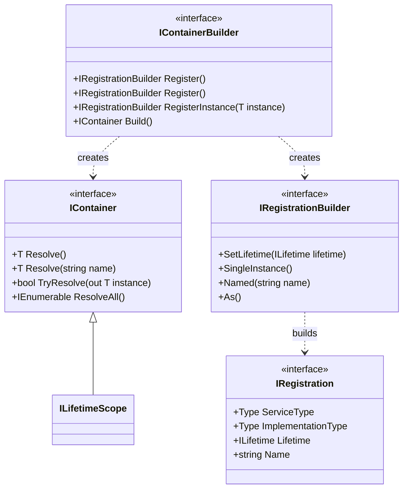
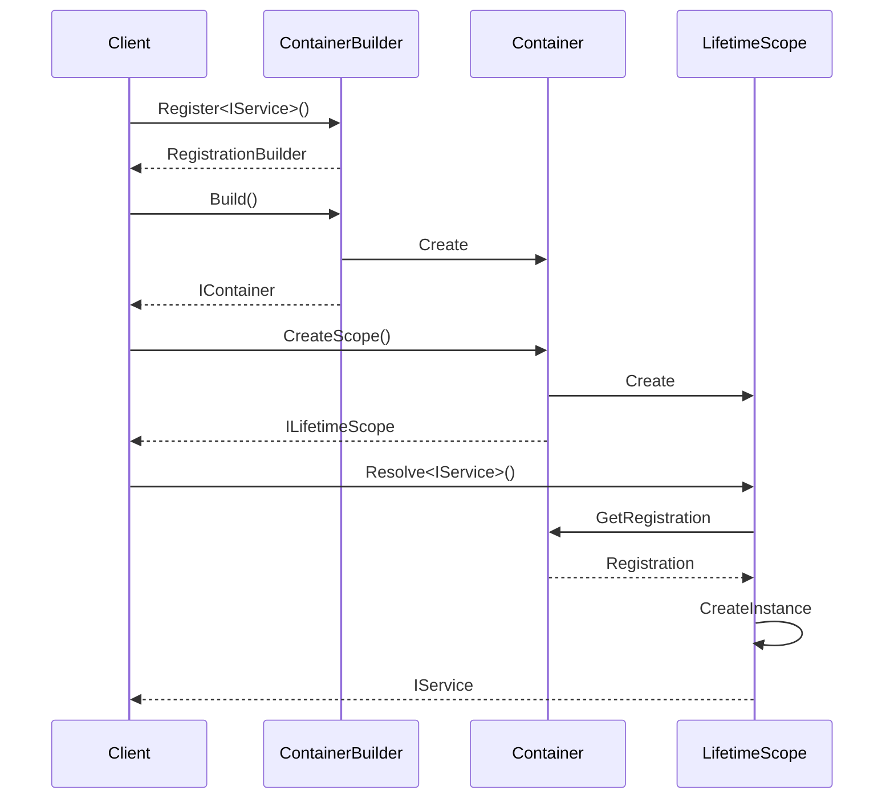

# 容器UML类图

## 容器接口关系

```mermaid
classDiagram
    class IContainer {
        <<interface>>
        +T Resolve<T>()
        +T Resolve<T>(string name)
        +bool TryResolve<T>(out T instance)
        +IEnumerable<T> ResolveAll<T>()
    }
    
    class IContainerBuilder {
        <<interface>>
        +IRegistrationBuilder<TService> Register<TService>()
        +IRegistrationBuilder<TService> Register<TService, TImplementation>()
        +IRegistrationBuilder<T> RegisterInstance<T>(T instance)
        +IContainer Build()
    }
    
    class IRegistration {
        <<interface>>
        +Type ServiceType
        +Type ImplementationType
        +ILifetime Lifetime
        +string Name
    }
    
    class IRegistrationBuilder {
        <<interface>>
        +SetLifetime(ILifetime lifetime)
        +SingleInstance()
        +Named(string name)
        +As<TService>()
    }
    
    IContainer <|-- ILifetimeScope
    IContainerBuilder ..> IContainer : creates
    IContainerBuilder ..> IRegistrationBuilder : creates
    IRegistrationBuilder ..> IRegistration : builds
```

## 容器生命周期

```mermaid
sequenceDiagram
    participant Client
    participant Builder as ContainerBuilder
    participant Container
    participant Scope as LifetimeScope
    
    Client->>Builder: Register<IService>()
    Builder-->>Client: RegistrationBuilder
    Client->>Builder: Build()
    Builder->>Container: Create
    Builder-->>Client: IContainer
    
    Client->>Container: CreateScope()
    Container->>Scope: Create
    Container-->>Client: ILifetimeScope
    
    Client->>Scope: Resolve<IService>()
    Scope->>Container: GetRegistration
    Container-->>Scope: Registration
    Scope->>Scope: CreateInstance
    Scope-->>Client: IService
``` 