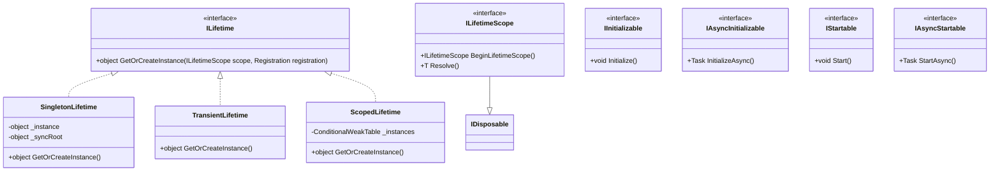
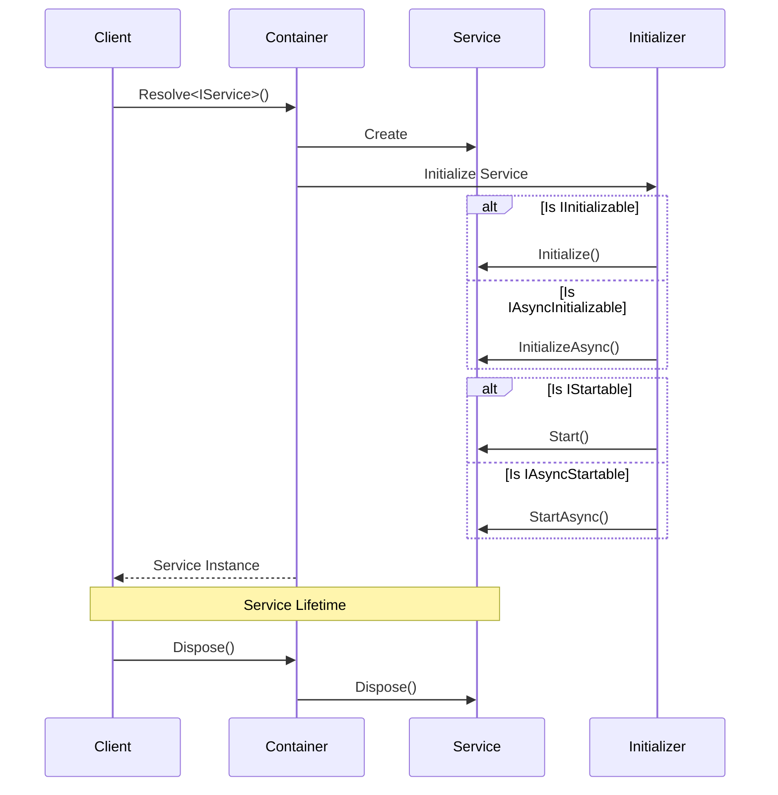
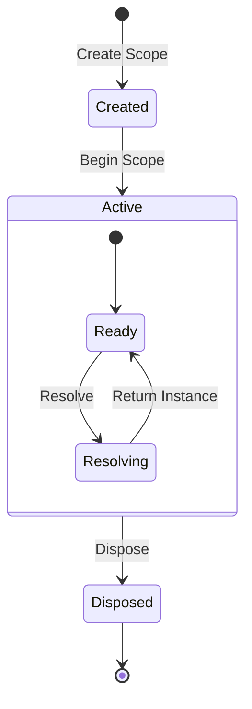

# 生命周期UML类图

## 生命周期接口关系

```mermaid
classDiagram
    class ILifetime {
        <<interface>>
        +object GetOrCreateInstance(ILifetimeScope scope, Registration registration)
    }
    
    class ILifetimeScope {
        <<interface>>
        +ILifetimeScope BeginLifetimeScope()
        +T Resolve<T>()
    }
    
    class IInitializable {
        <<interface>>
        +void Initialize()
    }
    
    class IAsyncInitializable {
        <<interface>>
        +Task InitializeAsync()
    }
    
    class IStartable {
        <<interface>>
        +void Start()
    }
    
    class IAsyncStartable {
        <<interface>>
        +Task StartAsync()
    }
    
    class SingletonLifetime {
        -object _instance
        -object _syncRoot
        +object GetOrCreateInstance()
    }
    
    class TransientLifetime {
        +object GetOrCreateInstance()
    }
    
    class ScopedLifetime {
        -ConditionalWeakTable<ILifetimeScope, object> _instances
        +object GetOrCreateInstance()
    }
    
    ILifetime <|.. SingletonLifetime
    ILifetime <|.. TransientLifetime
    ILifetime <|.. ScopedLifetime
    ILifetimeScope --|> IDisposable
```

## 生命周期流程

```mermaid
sequenceDiagram
    participant Client
    participant Container
    participant Service
    participant Initializer
    
    Client->>Container: Resolve<IService>()
    Container->>Service: Create
    Container->>Initializer: Initialize Service
    
    alt Is IInitializable
        Initializer->>Service: Initialize()
    else Is IAsyncInitializable
        Initializer->>Service: InitializeAsync()
    end
    
    alt Is IStartable
        Initializer->>Service: Start()
    else Is IAsyncStartable
        Initializer->>Service: StartAsync()
    end
    
    Container-->>Client: Service Instance
    
    Note over Client,Service: Service Lifetime
    
    Client->>Container: Dispose()
    Container->>Service: Dispose()
```

## 作用域生命周期

```mermaid
stateDiagram-v2
    [*] --> Created: Create Scope
    Created --> Active: Begin Scope
    Active --> Disposed: Dispose
    
    state Active {
        [*] --> Ready
        Ready --> Resolving: Resolve
        Resolving --> Ready: Return Instance
    }
    
    Disposed --> [*]
``` 