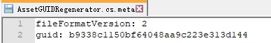
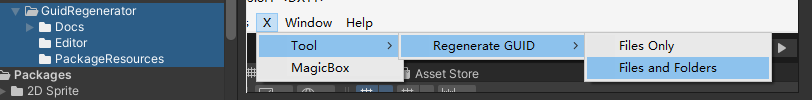

# Unity GUID Regenerator
 

用于为资产重新生成 GUID 的 Unity 编辑器工具

> 警告 **免责声明**: 除非遇到某些问题，否则不建议故意修改资产GUID

## Unity中的GUID是什么?
GUID 是在创建新资产时自动生成和分配的唯一哈希值。 当序列化资产引用另一个资产时，将使用此 GUID。

它存储在资产的元文件中。 您可以在文本编辑器中手动打开并查看元文件以获取 GUID。 但是，Unity 有其 [AssetDatabase](https://docs.unity3d.com/ScriptReference/AssetDatabase.html) API，可用于访问资产并对其执行操作。

## 为什么要重新生成 GUID?
当您处理基于现有项目的多个项目时，大多数资产很可能具有相同的 GUID。 当您稍后从现有项目添加更多资产时，这可能会导致一些问题。 Unity 将无法区分具有相同 GUID 的资源之间的差异，即使它们具有不同的文件名和内容。 这可能会导致 Unity 将引用关联到错误的资源。

最简单的解决方法是复制资产。 新创建的资源将拥有由 Unity 分配的自己的 GUID。 但是，您需要手动替换场景、预制件等中的所有引用。

## Installation
1. Unity Editor > Windows > Package Manager
2. Add package from git URL...
3. Enter `https://github.com/Tianyuyuyuyuyuyu/TByd/tree/main/TByd.Framework.GuidRegenerator.git`

## Usage

1. 选择一项或多项资产（不支持文件夹）
2. MenuItem > X > Tool > **Regenerate GUID**
3. 将有一个弹窗来警告并确认操作. **点击 继续**.
4. 等待操作完成. *请注意，对于较大的项目，这将需要很长时间.*
5. 控制台中将记录一份报告详细说明哪些asset更新或跳过.

## Notes
- 场景总是被跳过，因为这会破坏场景.

## Author
- [Tian Yu](https://github.com/Tianyuyuyuyuyuyu)

## License
This project is open source and available under the [MIT License](LICENSE).
